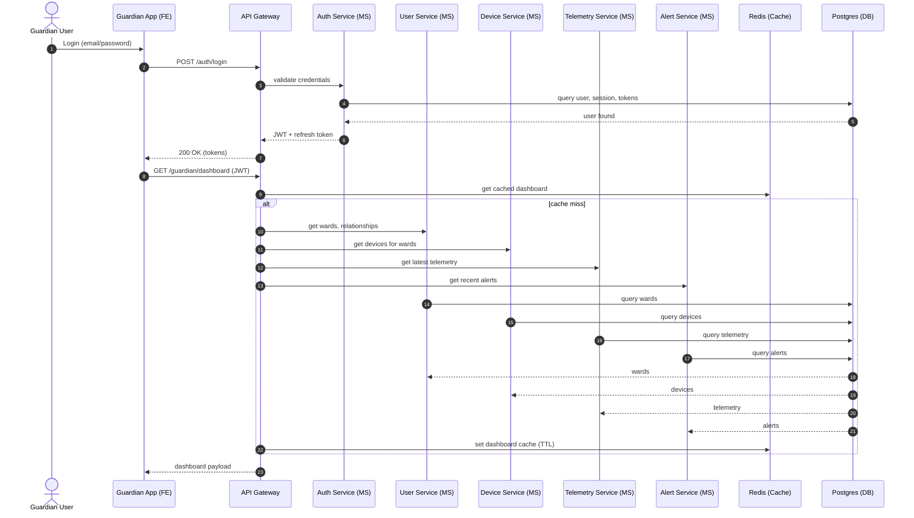
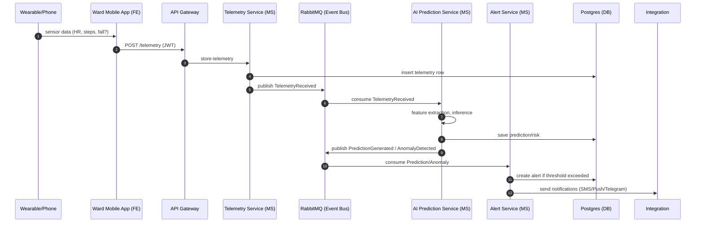
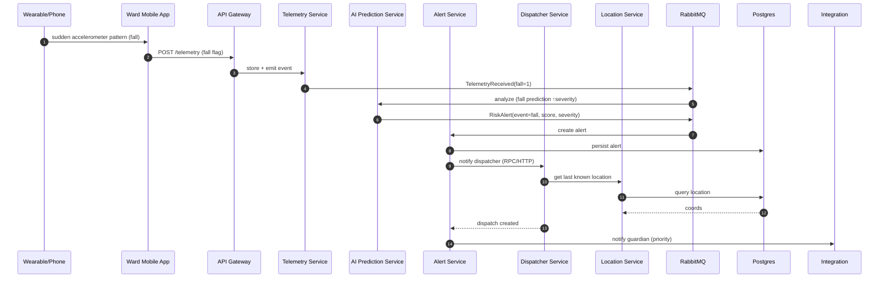
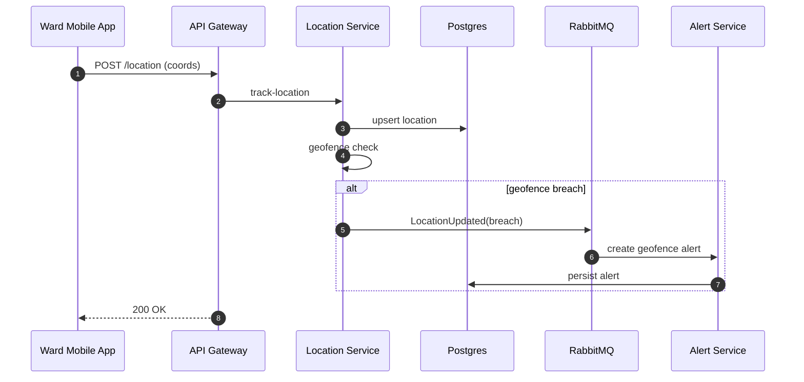
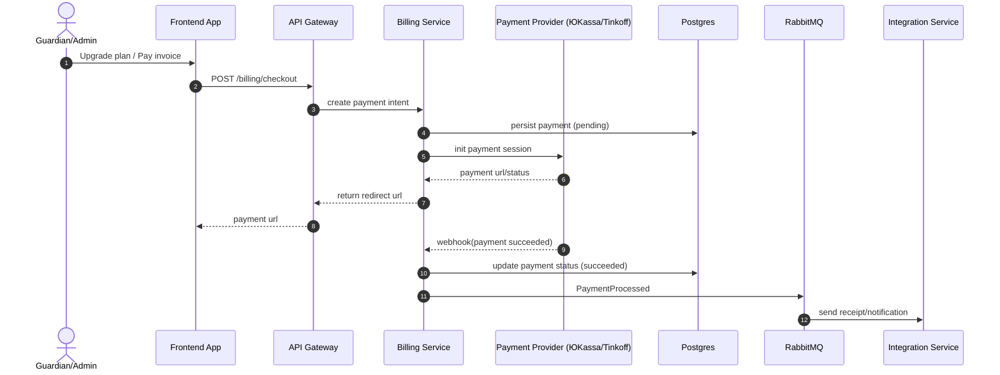
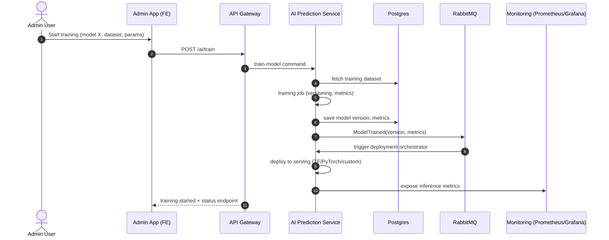
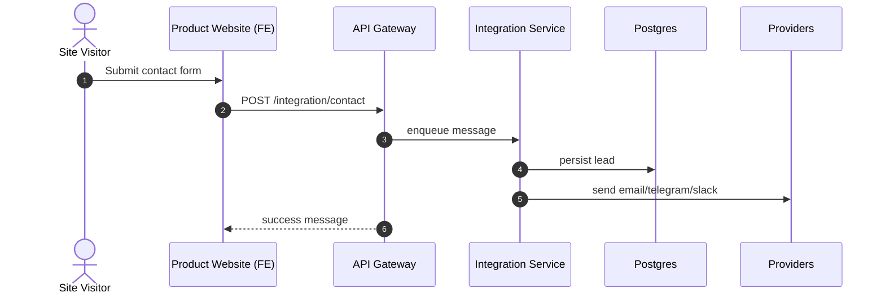

# Диаграммы взаимодействия компонентов

Ниже представлены ключевые взаимодействия компонентов системы согласно сценариям. Диаграммы используют условные обозначения:
- FE: фронтенд-приложения (`product-website`, `guardian-app`, `dispatcher-app`, `admin-app`)
- API Gateway: единая точка входа в backend
- MS: микросервисы (auth, user, device, telemetry, alert, location, billing, integration, dispatcher, analytics, ai-prediction)
- Infra: брокер сообщений (RabbitMQ), кеш (Redis), БД (Postgres), мониторинг

## 1) Аутентификация и загрузка дашборда опекуна



## 2) Поток телеметрии от носимого устройства и предикция ИИ



## 3) Обработка аварийного события (падение) и диспетчеризация



## 4) Отслеживание местоположения и геозоны



## 5) Выставление счетов и оплата



## 6) Админ: тренировка и деплой ML‑модели



## 7) Веб‑сайт продукта: заявка и контакты



---

Карта взаимодействий покрывает критические пользовательские сценарии: аутентификация, поток телеметрии, предиктивная аналитика/тревоги, геозоны, биллинг, ML‑жизненный цикл и лендинг. При необходимости расширю детализацию (конкретные эндпойнты, схемы событий, payload’ы, ретраи и деградационные сценарии).
*** End Patch*** }```}


